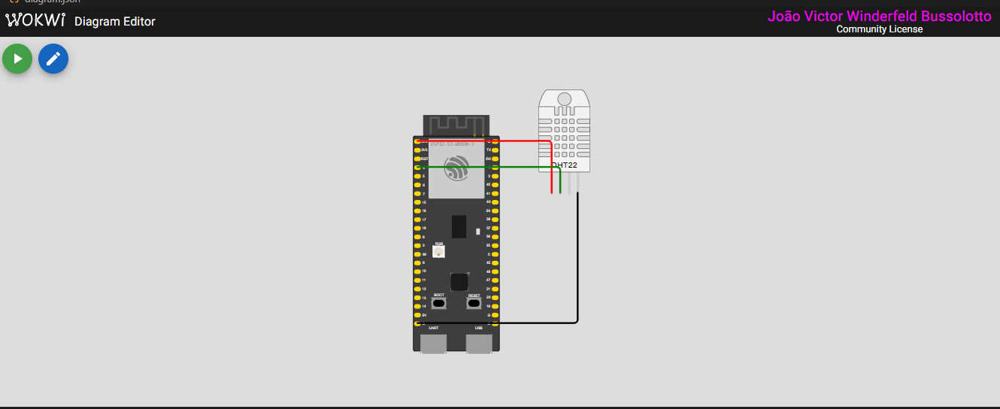
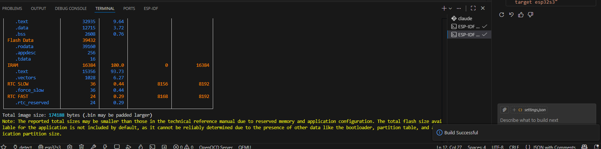
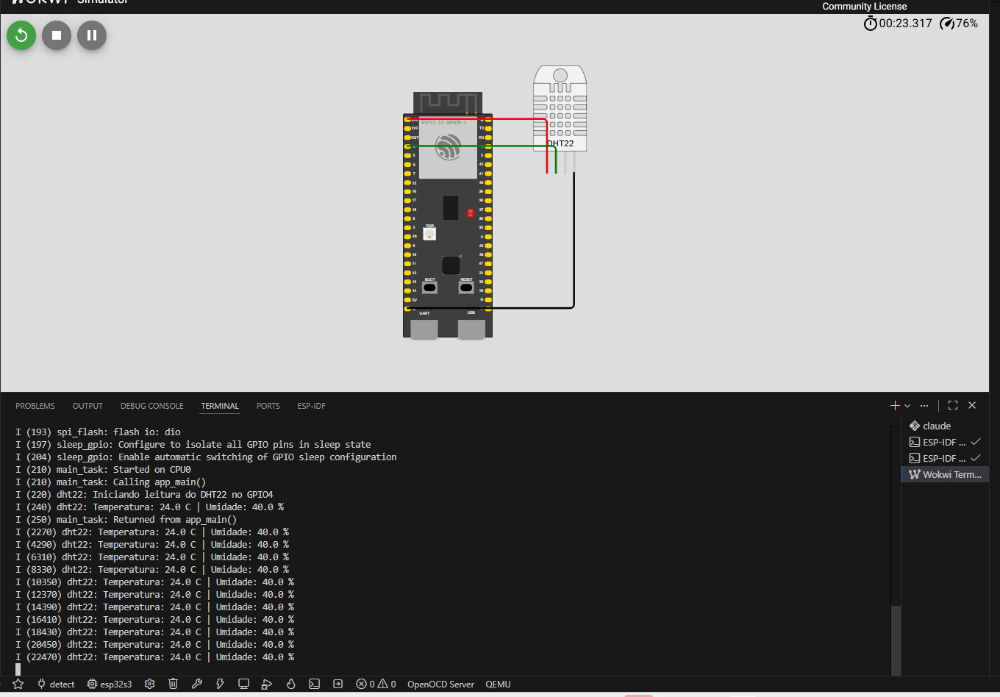

# Leitura do DHT22 no ESP32-S3 com ESP-IDF e Wokwi

Repositório: https://github.com/joaowinderfeldbussolotto/embedded-systems-dht22

Atividade da pós-graduação: aplicação embarcada em C que lê temperatura e umidade de um sensor DHT22 simulado no Wokwi, ligado a um ESP32-S3, e imprime os valores no monitor serial. Tudo roda pelo VS Code, com as extensões do ESP-IDF e do Wokwi.

## Estrutura do repositório

```
.
├── main/
│   ├── main.c              # leitura do sensor e log no monitor serial
│   ├── CMakeLists.txt
│   └── idf_component.yml   # dependência esp-idf-lib/dht
├── CMakeLists.txt          # CMakeLists raiz do projeto ESP-IDF
├── diagram.json            # circuito do Wokwi (ESP32-S3 + DHT22)
├── wokwi.toml               # aponta o simulador pro binário compilado
├── sdkconfig.defaults        # alvo esp32s3 já pré-configurado
└── assets/                   # screenshots pedidas na entrega
```

O projeto está na raiz do repositório de propósito, para que o `wokwi.toml` e o `diagram.json` sejam encontrados direto pela extensão do Wokwi ao abrir a pasta no VS Code.

## 1. Configuração do ESP-IDF e da conta Wokwi

No VS Code precisam estar instaladas as extensões **ESP-IDF** (da Espressif) e **Wokwi Simulator**.

**ESP-IDF**: rodar `ESP-IDF: Open ESP-IDF Installation Manager`, instalar uma versão e conferir com `ESP-IDF: Doctor Command`. Testei o projeto na v5.5.5 e na v6.1, e as duas compilam sem erro e sem warning.

**Wokwi**: `F1` > `Wokwi: Request a new License`, entrar na conta (a gratuita já serve) e confirmar de volta no VS Code. Quando dá certo aparece a mensagem "License activated for ...".

Depois é só abrir a raiz deste repositório no VS Code e escolher o alvo com `ESP-IDF: Set Espressif Device Target` > `esp32s3` (o `sdkconfig.defaults` já traz o alvo, mas o comando garante).

Pra rodar: `ESP-IDF: Build Project` e depois `F1` > `Wokwi: Start Simulator`. O build vem primeiro porque o `wokwi.toml` aponta pro `build/flasher_args.json`, que só existe depois de compilar.

.png>)

.png>)

## 2. Circuito no Wokwi

O circuito está no `diagram.json`, que abre direto no editor do Wokwi dentro do VS Code. São duas peças: a placa `board-esp32-s3-devkitc-1` e o sensor `wokwi-dht22`.

Ligações:
- VCC do sensor no 3V3 da placa
- GND do sensor no GND da placa
- SDA (dados) do sensor no GPIO4
- TX e RX da placa no monitor serial do Wokwi

Escolhi o GPIO4 porque não é pino de boot (0, 3, 45 e 46) nem de flash, PSRAM ou USB, então não atrapalha a inicialização da placa. Não pus resistor de pull-up no diagrama porque o pull-up é ligado por software (seção 3).



## 3. Código

A leitura usa a biblioteca `esp-idf-lib/dht`, declarada em `main/idf_component.yml`. O gerenciador de componentes baixa ela na primeira compilação, então essa primeira vez precisa de internet.

O `main/main.c` faz o seguinte:
- `app_main` liga o pull-up interno do GPIO4. A biblioteca usa o pino em dreno aberto (ele só puxa pra baixo), então sem pull-up o nível alto nunca sobe. Depois cria uma task.
- A task chama `dht_read_float_data()` a cada 2 segundos e imprime temperatura e umidade com `ESP_LOGI`. Se a leitura falhar, imprime o erro com `ESP_LOGE`.
- O tipo é `DHT_TYPE_AM2301`, que na biblioteca cobre DHT21 e DHT22.

O enunciado sugere o DHT11, mas o Wokwi só tem a peça DHT22 (não existe DHT11 lá), então usei o DHT22. O protocolo é o mesmo, de um fio só, e ele tem mais resolução. O intervalo de 2 s existe porque o sensor não deve ser lido com mais frequência que isso.

## 4. Build (código compilando sem erros)

Saída do `idf.py build`, tamanho do binário:

```
ESP-IDF v5.5.5:
dht22_serial.bin binary size 0x2f870 bytes. Smallest app partition is 0x100000 bytes. 0xd0790 bytes (81%) free.
Project build complete.

ESP-IDF v6.1:
dht22_serial.bin binary size 0x2a8e0 bytes. Smallest app partition is 0x100000 bytes. 0xd5720 bytes (83%) free.
Project build complete.
```



## 5. Monitor serial (sensor iniciado e dados lidos)

Saída serial de 9 segundos de simulação (ESP-IDF v5.5.5), rodando o firmware no Wokwi pela linha de comando com o `wokwi-cli`:

```
I (230) dht22: Iniciando leitura do DHT22 no GPIO4
I (250) dht22: Temperatura: 24.0 C | Umidade: 40.0 %
I (2280) dht22: Temperatura: 24.0 C | Umidade: 40.0 %
I (4300) dht22: Temperatura: 24.0 C | Umidade: 40.0 %
I (6320) dht22: Temperatura: 24.0 C | Umidade: 40.0 %
I (8340) dht22: Temperatura: 24.0 C | Umidade: 40.0 %
```

São cinco leituras, uma a cada 2 s, sem nenhuma falha. Os 24 °C e 40 % são os valores padrão da peça no Wokwi. Durante a simulação dá pra mudar os dois clicando no sensor, e a próxima leitura acompanha.


