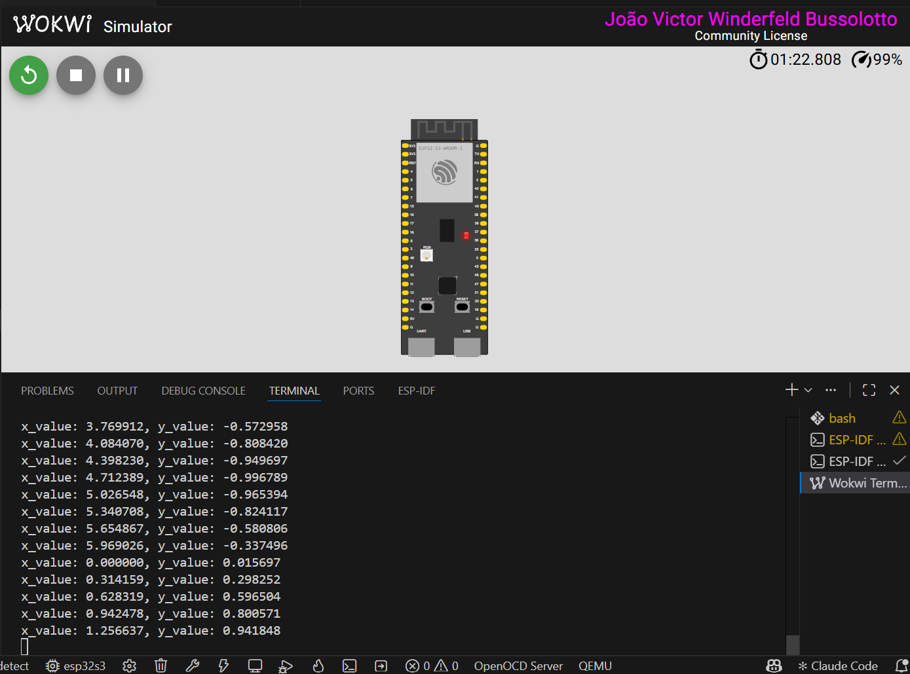
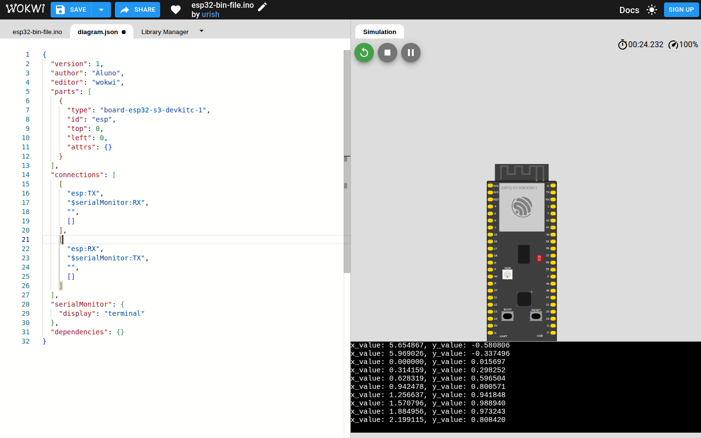

# Relatório: TFLite Micro Hello World no ESP32-S3 (Wokwi)

Código: [https://github.com/joaowinderfeldbussolotto/embedded-systems-dht22/tree/feature/task4](https://github.com/joaowinderfeldbussolotto/embedded-systems-dht22/tree/feature/task4)

Reproduzi o Hello World do TensorFlow Lite Micro de ponta a ponta: treinei o modelo de seno, quantizei pra int8, converti pra C, compilei o firmware com o ESP-IDF e rodei no Wokwi. Abaixo estão o que deu certo e o que encontrei de estranho no código e na documentação. Tudo aqui foi medido na hora, nas versões ESP-IDF v5.5.5 e v6.1, TensorFlow 2.21 e NumPy 2.4.

## 1. O que foi feito

1. Rodei o notebook de treino (`treinamento/hello_world_training.ipynb`): rede 1-32-32-1, 300 épocas, depois conversão pra `hello_world_float.tflite` e `hello_world_int8.tflite`. Fiz duas mudanças no notebook: troquei `/content/hello_world_models` por `hello_world_models` pra rodar fora do Colab, e corrigi uma linha na dequantização (seção 3).
2. Gerei o `main/model.cc` a partir do int8 com `xxd -i` (`treinamento/gerar_model_cc.sh`).
3. Peguei o exemplo `hello_world` do `esp-tflite-micro` pelo registry (`idf.py create-project-from-example`), troquei só o modelo e compilei pro ESP32-S3.
4. Simulei no Wokwi. O print principal (extensão do VS Code) está em `docs/wokwi-hello-world.png` e o do simulador web em `docs/wokwi-hello-world-web.png` (origem de cada um na seção 6).

## 2. Resultados

Treino, erro contra `sin(x)` em 1000 pontos (notebook):

| Modelo | MAE | RMSE |
| --- | --- | --- |
| Float (esta execução) | 0,0099 | 0,0139 |
| Int8 (esta execução) | 0,0116 | 0,0165 |
| Float (Colab) | 0,0134 | 0,0181 |
| Int8 (Colab) | 0,0187 | 0,0233 |

O treino não tem semente, então cada execução dá números um pouco diferentes (numa primeira execução meu float deu MAE 0,0048). A quantização piorou o erro pouco: 0,0017 de MAE nesta execução.

Firmware, 20 pontos de 0 a 2π, comparado com `sin(x)`:

| Modelo | Tamanho | Arena usada (de 2000 B) | MAE | RMSE |
| --- | --- | --- | --- | --- |
| Original do exemplo (1-16-16-1) | 2488 B | 724 B | 0,0370 | 0,0460 |
| Treinado no notebook (1-32-32-1) | 5160 B | 1268 B | 0,0124 | 0,0150 |

O modelo treinado ficou mais preciso e ainda cabe na arena de 2000 bytes do exemplo.

Compilação: passou no v5.5.5 e no v6.1, e a saída serial no Wokwi foi idêntica nas duas versões. Teve 8 warnings nas duas, todos o mesmo `-Wshadow` em `sub.h`, que é código do `esp-tflite-micro` e não do projeto.

## 3. Observações sobre o código

No firmware (C++):

- A entrada é quantizada com `int8_t x_quantized = x / scale + zero_point;`, que trunca em vez de arredondar e não limita à faixa do int8. O notebook faz o contrário (`np.round` e `clip`). Emulando no PC a aritmética em float32 do C++, o modelo treinado bateu com o firmware em 20 de 20 pontos quando a entrada é truncada, e só em 12 de 20 (diferença máxima de 0,039) quando é arredondada. Então a avaliação em Python não representa exatamente o que roda no chip.
- A arena é fixa em 2000 bytes e o código não avisa quanto usa. O modelo original usa 724 B e o meu 1268 B (medi imprimindo `arena_used_bytes()` num build à parte, que não está no repositório). Com um modelo maior o `AllocateTensors()` falharia.

No notebook:

- O comentário diz 16 neurônios, mas as camadas têm 32 (confirmei com `create_model()`: `[32, 32, 1]`).
- `get_data` e `save_tflite_model` são definidas duas vezes, e a segunda `get_data` devolve só `x`. Se eu reexecuto a célula de treino depois da de quantização, dá `ValueError: too many values to unpack (expected 2)`. Reproduzi isso.
- `generate_random_int8_input` nunca é usada, e o `astype(np.int8)` deixa só os inteiros de 0 a 6.
- Com NumPy 2, `dequantize_output` estoura: `output_value` é `np.int8` e `output_value - zero_point` continua int8. Com zero_point -1, a saída 127 vira -128 e a quantizada deu MAE 0,0525 e RMSE 0,2773, contra 0,0146 e 0,0181 no mesmo modelo depois de trocar por `int(output_value) - zero_point`. Fiz essa troca de uma linha no notebook entregue. É por isso que os números dele ficam coerentes aqui.
- O avaliador cai pro interpretador do TF Lite porque o `tflite_micro` não está instalado (só um `WARNING`), então o caminho "TFLM" nunca roda. Também saem avisos do Keras (`input_shape` em `Sequential`) e do `tf.lite.Interpreter`, que está marcado como deprecated.

## 4. Observações sobre a documentação

- O README do exemplo diz que foi testado nos ESP-IDF 4.2 e 4.4 e que o S3 precisa da 4.4. O componente atual (1.4.1) pede ESP-IDF 5.1 ou mais, e eu compilei com 5.5.5 e 6.1 sem problema.
- Diz que traz o fluxo completo, inclusive o treino, mas a pasta do exemplo não tem `train/`, e o cabeçalho do `model.cc` manda ver um `train/README.md` que não está lá.
- Fala em piscar LEDs ou controlar uma animação, mas o `output_handler.cc` só imprime `x_value` e `y_value` no log.
- O comentário do `main/CMakeLists.txt` cita `micro_speech`, resto de cópia de outro exemplo.
- No GitHub, o `main/idf_component.yml` tem `override_path: "../../../"`, que só funciona dentro do repositório. A cópia que sai do registry não tem essa linha.
- O `sdkconfig.defaults` tem `CONFIG_ESP32_DEFAULT_CPU_FREQ_MHZ=240`, que o S3 ignora (o kconfig avisa `unknown kconfig symbol`) e a placa roda a 160 MHz. Já `CONFIG_INT_WDT=` e `CONFIG_TASK_WDT=` funcionam, porque o `sdkconfig.rename` do ESP-IDF converte os nomes antigos.
- O README do exemplo não fala de simulação. No Wokwi o S3 precisou de um ajuste (seção 5).

## 5. O Wokwi e o S3

Com a configuração padrão (`CONFIG_NN_OPTIMIZED`, que no S3 usa assembly do `esp-nn`), o exemplo original rodou no Wokwi mas o `y_value` ficou travado em `-1.118309` pra qualquer `x` (nas 24 linhas que li). Esse número é a saída quantizada mínima, -128, desquantizada: (-128 - 4) x 0,008472.

Duas coisas deram certo: compilar com `CONFIG_NN_ANSI_C=y` (kernels em C) no S3, e compilar pro ESP32 comum com os kernels otimizados padrão. Nos dois casos a saída acompanhou o seno, e as 24 linhas que comparei entre os dois foram idênticas. Isso aponta pro assembly do S3 como o problema no simulador, mas eu não testei em hardware real, então não sei se é limitação do Wokwi ou outra coisa. O projeto deixa `CONFIG_NN_ANSI_C=y` no `sdkconfig.defaults`, com um comentário explicando.

## 6. Prints

Figura 1: extensão do Wokwi no VS Code, placa ESP32-S3, terminal serial com `x_value` e `y_value`. É o print principal, tirado na máquina do autor com o projeto compilado lá.

Figura 2: simulador web do Wokwi (wokwi.com). Eu carreguei o `uf2` gerado deste projeto num template de upload de firmware do Wokwi, com um Chromium sem interface, em 02/10/2026. Usei só pra conferir o resultado no ambiente onde rodei o resto.

As duas figuras mostram os mesmos valores nas linhas em comum, por exemplo `x = 0` dá `0.015697` e `x = 1.256637` dá `0.941848`. Na Figura 1 também aparecem as linhas finais do ciclo, de `3.769912` (`-0.572958`) até `5.969026` (`-0.337496`), e todas coincidem com o log serial que obtive no meu ambiente. Isso indica que o ajuste `CONFIG_NN_ANSI_C=y` vale também na extensão. O print não mostra qual versão do ESP-IDF foi usada na máquina do autor.
